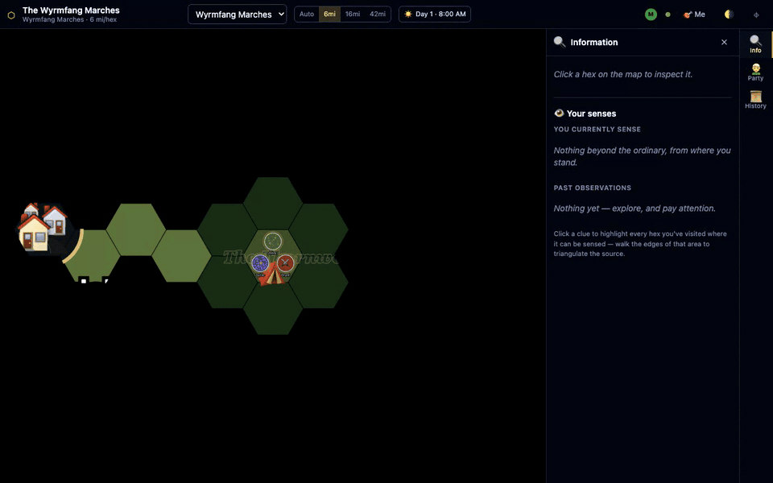
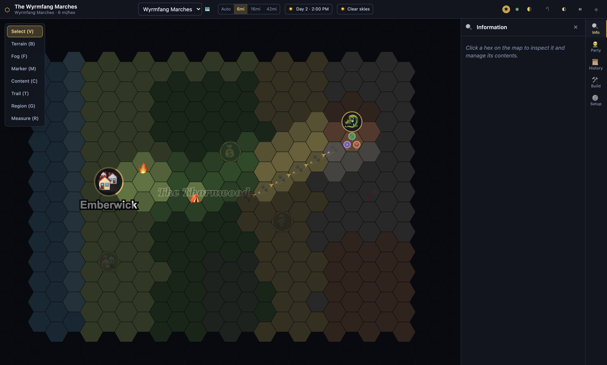
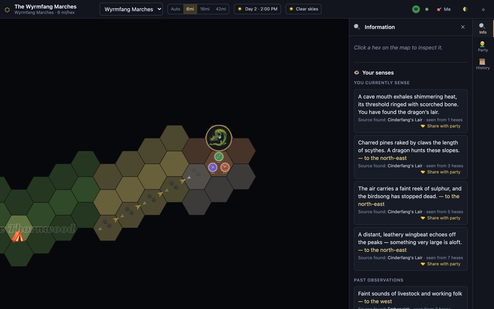
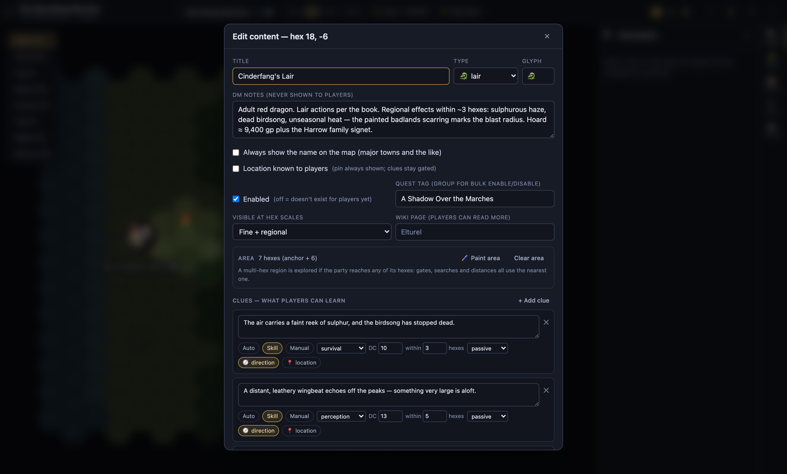
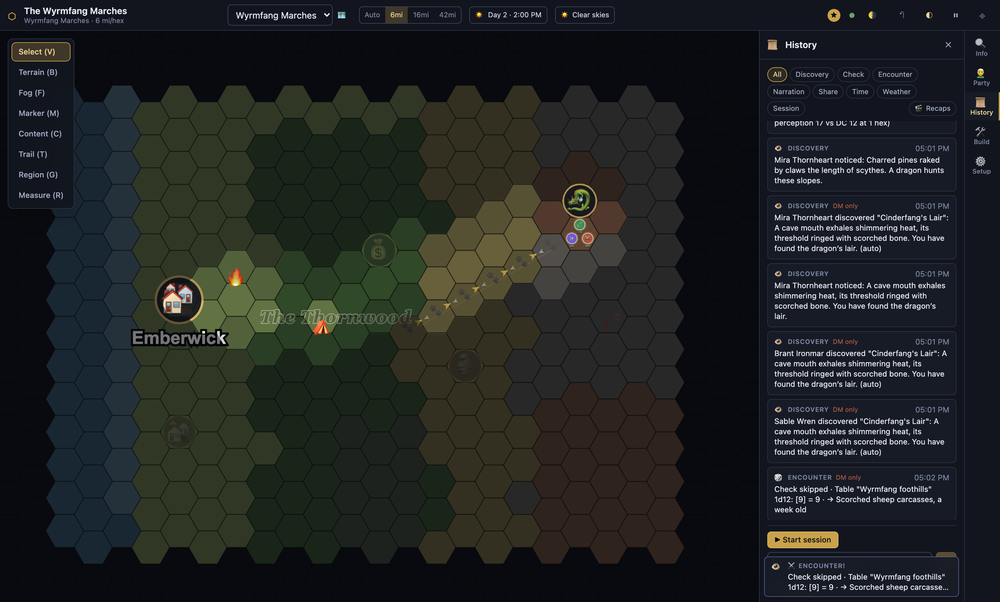
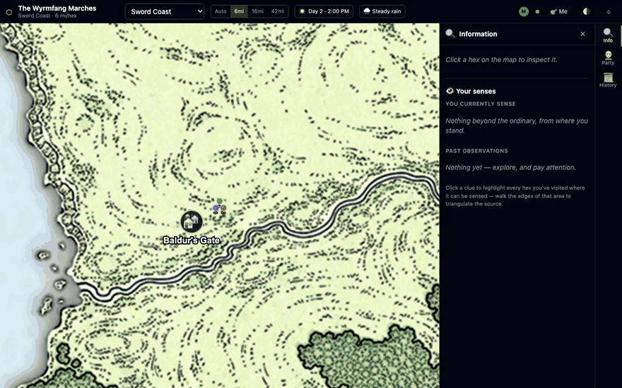

# HexCrawl VTT

A self-hosted virtual tabletop purpose-built for **hex crawl exploration** in
D&D-style TTRPGs. Not a generic battle-map tool — it is built around the loop
of travelling an unknown wilderness: fog of war that lifts as the party moves,
clues that surface automatically when a character's passive Perception is good
enough, wandering-encounter tables bound to terrain, and a strict server-side
boundary that means players are never sent information they haven't earned.

One container, one volume, no accounts. The DM shares a link; players open it,
pick a character, and play.



*A player's view of the whole loop: fog lifts as the party travels, a town
announces itself by chimney smoke ("— to the west"), a drag-trail crosses the
foothills, and the hints sharpen — sulphur, wingbeats, clawed pines — until the
party walks into the dragon's lair. Every reveal was computed server-side from
that character's passive skills, the distance, and the clue's DC; nothing a
player hasn't earned ever reaches their browser.*

## What it does

- **Fog of war** — auto-reveals around party tokens at a configurable sight
  radius; hexes optionally fade to "explored" once left behind. Fog is a dark
  sheet with per-hex holes cut out, so players physically cannot see under it.
- **Knowledge / clue engine** — attach clues to any hex, each with a gate:
  *auto* (on entry), *skill* (e.g. "DC 14 Perception within 2 hexes", evaluated
  continuously against each character's passive score as tokens move), or
  *manual*. Qualifying players get a private discovery and journal entry; the DM
  gets the full derivation in the log.
- **Trails** — tracks and spoor left behind, discoverable by the same gating.
- **Encounters** — DMG-style wandering-encounter tables (dice range → result,
  optional quantity dice) bound to terrain types; roll trigger die, table entry,
  and quantity in one click, DM-only until you share.
- **Time** — travel and watch tracking that drives encounter checks.
- **Multi-scale hexes** — three hex scales built from 7-hex superclusters
  (H3-style): base (e.g. 6 mi), ×√7 (≈16 mi), ×7 (42 mi). The scale follows your
  zoom, or lock one (travel at 16, search at 6).
- **Maps** — paint 12 terrain types with brushes, or upload a map image and
  align the grid over it. Multiple maps per campaign.
- **Party** — characters with skill modifiers (Perception, Survival, Nature,
  Arcana, Religion, plus custom skills). Players can create and edit their own.
- **Group skill checks, markers, measurement** — d20-per-character checks with
  DM-only results, effect markers (🔥 ⛈️ ⛺ 🐉) that are player-visible or not,
  and a ruler.
- **Real-time for the whole table** over WebSockets, with separate DM and player
  views.

## Screenshots

**The DM's table** — the whole crawl at a glance: painted terrain, the party
mid-journey, an always-labeled town, a hidden village, a buried cache, a
drag-trail, and the scorched hexes around a dragon's lair. Undiscovered
content is dimmed for the DM — and simply absent for players.



**The same moment from a player's browser** — only explored hexes exist. The
*Your senses* panel lists what this character has perceived, each clue with an
auto-computed compass bearing; clicking one highlights every visited hex it
can be sensed from, so the party can triangulate a source it hasn't found.



**The clue editor** — a dragon's lair whose regional effects are gated,
directional clues: sulphur on the wind (Survival DC 10 within 3 hexes),
wingbeats off the peaks (Perception DC 13 within 5), clawed trees that pin
the location down (Perception DC 12, adjacent). The lair's multi-hex
footprint means every distance check uses its nearest hex.



**Wandering encounters and the DM log** — terrain-bound tables rolled in one
click (trigger die, table entry, quantity dice), and the full derivation of
every discovery in the DM-only log.



**Real map art instead of painted terrain** — upload a map image (or a pair:
the *player* version as a visible layer, the *labeled* DM version as a
DM-only layer) and align the hex grid over it. Players crawl the clean map
with fog lifting hex by hex; the DM works on the labeled one — here the party
travels the River Chionthar east of Baldur's Gate into the night, and the
view then cuts to what the DM sees of the same moment.



## Quick start

### Docker (one command)

```bash
docker run -d --name hex-crawl \
  -p 3000:3000 \
  -v hexcrawl_data:/data \
  ghcr.io/wvaske/hex-crawl-app:latest
```

Open <http://localhost:3000>, create a campaign, and you're at the DM table.
There are no accounts: the **Setup tab** gives you a private **DM link** and a
shareable **player link**. Players open the player link, enter a name, and claim
a character.

Everything persists in the `hexcrawl_data` volume (SQLite database + uploaded
map images). Back a campaign up by copying that volume; restore it by putting it
back.

### Docker Compose

For a longer-lived deployment — including an optional Caddy reverse proxy that
gets you HTTPS on a real domain automatically:

```bash
curl -O https://raw.githubusercontent.com/wvaske/hex-crawl-app/main/deploy/docker-compose.example.yml
curl -o .env https://raw.githubusercontent.com/wvaske/hex-crawl-app/main/.env.example
docker compose -f docker-compose.example.yml up -d
```

See [`deploy/docker-compose.example.yml`](deploy/docker-compose.example.yml) for
the reverse-proxy block and a backup one-liner. The other files in `deploy/`
(`docker-compose.yml`, `traefik-hex-crawl.yml`, `RUNBOOK.md`) are the
maintainer's homelab deployment — useful as advanced examples, but not the place
to start.

Images are published for `linux/amd64` and `linux/arm64` on every release tag
(`:1.2.3`, `:1.2`, `:latest`) and every push to `main` (`:main`).

## Configuration

All runtime config is environment variables with working defaults — the app runs
with none of them set. Copy [`.env.example`](.env.example) to `.env` and edit;
the server reads it at startup, and real environment variables always take
precedence over the file. **Never commit `.env`.**

| Variable | Default | What it is |
|---|---|---|
| `PORT` | `3000` | TCP port for HTTP + WebSocket. |
| `HOST` | `0.0.0.0` | Bind interface. `0.0.0.0` inside Docker; `127.0.0.1` to accept only local connections behind a host reverse proxy. |
| `DATA_DIR` | `./data` (`/data` in the image) | All persistent state: SQLite db and uploaded images. Back up this directory. |
| `CLIENT_DIST` | unset (`/app/client-dist` in the image) | Path to the built client. When set, the server serves the web UI too; unset means API/WebSocket only (development, where Vite serves the client). |

Optional hardening, worth setting if strangers can reach your instance:

| Variable | Default | What it is |
|---|---|---|
| `CREATE_PASSWORD` | unset | **Secret.** When set, creating *or* restoring a campaign requires this password (the landing page grows a password field). Unset means anyone who can load the page can create a campaign. |
| `UPLOAD_QUOTA_MB` | `200` | Per-campaign cap on total uploaded image bytes. `0` disables. |
| `RATE_LIMIT_WINDOW_SEC` | `60` | Window for the per-IP rate limits below. |
| `RATE_LIMIT_CREATE` / `RATE_LIMIT_IMPORT` | `3` / `3` | Campaign creations / restores per IP per window. `0` disables. |
| `RATE_LIMIT_JOIN` / `RATE_LIMIT_EXPORT` | `10` / `10` | Join attempts / archive downloads per IP per window. `0` disables. |
| `TRUST_PROXY` | `1` | Take the client IP from the first `X-Forwarded-For` hop. Correct behind a reverse proxy; set `0` when the server is exposed directly, or the limits can be spoofed away. |

**Threat model in short.** There are no accounts: a campaign's player key and DM
key *are* the authorization, exchanged at join time for an HttpOnly seat cookie.
The DM key is also the integration API's Bearer token and the export endpoint's
`?key=`, so it grants everything — treat it like a password, and regenerate
either key from *Settings → Invite links* when a link leaks (old links stop
working immediately; already-seated players stay connected). Player clients only
ever receive server-filtered state, so DM notes and fogged terrain are not
hiding in the browser. Uploaded images, however, are served from unguessable but
uncontrolled URLs, and the app expects TLS to be terminated in front of it.
[`deploy/RUNBOOK.md`](deploy/RUNBOOK.md) § Security has the full table, including
what is still missing (seat expiry, kick/ban, seat caps).

Optional, for the AI integration bridge (`mcp/hexcrawl-mcp.mjs`) rather than the
app server:

| Variable | Default | What it is |
|---|---|---|
| `HEXCRAWL_URL` | `http://localhost:3000` | Base URL of your instance. |
| `HEXCRAWL_CAMPAIGN` | — | Campaign id, from the DM link. |
| `HEXCRAWL_TOKEN` | — | **Secret.** The campaign DM key — full DM access to that campaign. |

`DATABASE_URL` switches storage from the embedded SQLite file to Postgres
(the export/import archive is the migration path between them).
`.env.example` also reserves names for planned integrations (`WIKI_API_URL`,
`WIKI_BOT_USER`, `WIKI_BOT_PASSWORD`, `PUBLIC_URL`); nothing reads those yet.
Letting players read your campaign wiki is *not* one of them — that works
today and is configured in the app, not the environment: see
[Linking a wiki](#linking-a-wiki).

Per-campaign DM and player join secrets are generated by the app and live in the
database under `DATA_DIR` — they are never configuration.

## Running a hex crawl

**Prep (DM):**

1. **Map** — paint terrain with the 🖌️ tool (12 terrain types, brush sizes
   1/7/19), and/or upload a map image in the *Maps* tab, then nudge the grid
   origin and hex size until the grid lines up.
2. **Party** — create characters in the *Party* tab and enter their skill
   modifiers.
3. **Content** — with the 📖 tool, click a hex to add content (lair, dungeon,
   settlement, ruin, lore…) and give it clues with gates.
4. **Encounters** — build encounter tables in the *Encounters* tab, bound to
   terrain types.

**Play:** drop PC tokens from the *Tokens* tab; players drag their own token and
fog auto-reveals around it. As tokens move, the knowledge engine checks every
clue gate. Roll wandering encounters with one button. Trigger group skill checks,
then reveal clues per character, narrate to everyone, or whisper to one player.
Drop effect markers on hexes, visible to players or DM-only.

**Player view:** only revealed hexes, only visible tokens, only their own
character's discoveries. The server filters every byte a player receives — hidden
content never crosses the wire.

Each location's "Visible at hex scales" setting controls the coarsest scale its
pin appears at: cities and major regions show everywhere, hidden sites only when
searching fine hexes.

## Linking a wiki

Players who discover a place can read more about it without leaving the
table. Setup takes two fields:

1. **Setup tab → Campaign → "Wiki base URL"** — where your wiki's pages live.
   Any of these shapes work (page titles are appended):

   | Your wiki style | Base URL to enter |
   |---|---|
   | MediaWiki, short URLs | `https://wiki.example.com/wiki/` |
   | MediaWiki, plain | `https://wiki.example.com/index.php/` |
   | MediaWiki under `/w/` | `https://wiki.example.com/w/index.php/` |
   | Direct API endpoint | `https://wiki.example.com/api.php` |
   | Anything else (Notion, WorldAnvil, …) | the URL prefix your page titles append to |

2. **On any content pin → "Wiki page"** — the page title (`Emberwick`). A full
   `https://…` value works too and becomes a plain external link.

What players get:

- A **wiki ↗** link on every discovered pin that has a page. This works with
  any wiki or site — it's just a link.
- For **MediaWiki** wikis, an inline **"From the wiki"** reader in the
  location's *More…* dialog: the page is fetched server-side, sanitized, and
  split by headings, with *Overview* and *What the party knows* shown first
  and the rest behind a "Show full page" toggle.

How it stays safe: players never talk to your wiki directly. The server
proxies read-only page fetches through `GET /api/campaigns/:id/wiki-page`,
takes only a page *title* from the client (the endpoint always derives from
the DM-configured base URL), strips scripts/frames/handlers from the HTML,
and caches pages for five minutes. Leaving the base URL empty disables the
feature entirely.

Writing wiki pages that won't spoil your campaign — section layout, and the
rule that DM notes never go on a player-linked page — is covered in
[docs/WIKI-TEMPLATE.md](docs/WIKI-TEMPLATE.md). If an AI assistant maintains
your wiki, wire it to the map too: see [Integration API + MCP](#integration-api--mcp).

### DM keyboard shortcuts

| Key | Tool |
|---|---|
| `V` | Select / pan |
| `B` | Paint terrain |
| `F` | Fog brush |
| `M` | Marker |
| `C` | Content |
| `R` | Measure |
| hold `Space` | Pan with left-drag in any tool |
| `Esc` | Clear selection / close dialog |

## Development

Requires Node 22+ and pnpm (via corepack).

```bash
corepack enable
pnpm install
pnpm dev        # server :3000 + Vite client :5173, both on 0.0.0.0
```

```bash
pnpm test       # vitest across packages (hex math, rules, command pipeline)
pnpm typecheck  # strict TS everywhere
pnpm build      # production build
```

State lands in `./data/` (gitignored). To test the full stack without Vite:
`pnpm build`, then run the server with `CLIENT_DIST=../client/dist`.

Two browser sessions against one dev server need two hostnames — seat cookies
are per-hostname, so open the DM on `localhost` and a player on `127.0.0.1`.

Want something to click around in immediately?
`node docs/demo/seed-demo-campaign.mjs` builds the demo campaign from the
screenshots above — see [docs/demo/README.md](docs/demo/README.md).

### Workspace

| Package | Purpose |
|---|---|
| `packages/shared` | Hex math, domain schemas (zod), WS protocol, dice, game rules, player filter |
| `packages/server` | Hono + `ws`, SQLite (better-sqlite3) write-through state, command pipeline, knowledge/fog/trail/encounter engines |
| `packages/client` | React 19 + PixiJS 8 canvas engine, Zustand stores, DM and player UI |

### Architecture

- **One mutation path.** Every change is a zod-validated WebSocket command. The
  server applies it to SQLite synchronously, then rebroadcasts full,
  role-filtered snapshots (coalesced at ~40ms). There are no incremental
  updates, and no client ever receives unfiltered state.
- **One security boundary.** `filterStateForViewer` in
  `packages/shared/src/rules/filter.ts` is a pure, unit-tested function; it is
  the only thing standing between DM knowledge and a player's browser.
- **Seat auth.** Campaign links carry a role secret; claiming a seat sets an
  httpOnly cookie. Roles are enforced server-side per command.
- **Canvas.** A plain PixiJS 8 engine class subscribed to Zustand — React never
  touches the scene graph.

Full design rationale: **[docs/DESIGN.md](docs/DESIGN.md)**.
Conventions, gotchas, and workflow for AI-assisted contributions (which is how
most of this was built): **[docs/AI-DEVELOPMENT.md](docs/AI-DEVELOPMENT.md)**.

## Integration API + MCP

Other tools — e.g. a DM-companion agent that maintains a campaign wiki — can
manage map locations, trails, and settlement clues through
`/api/integration/campaigns/:id/...` using the campaign DM key as a Bearer
token. `mcp/hexcrawl-mcp.mjs` is a dependency-free stdio MCP server wrapping
that API so any MCP-capable AI assistant can be wired to a deployment in
minutes:

```bash
claude mcp add hexcrawl \
  -e HEXCRAWL_URL=https://hexcrawl.example.com \
  -e HEXCRAWL_CAMPAIGN=<campaignId> \
  -e HEXCRAWL_TOKEN=<dm key> \
  -- node /path/to/hex-crawl-app/mcp/hexcrawl-mcp.mjs
```

Locations can carry a `wikiPage`; players get a "wiki ↗" link on discovered
content (base URL configurable in Setup).

## AI integration

Full setup (env contract, registration for Claude Code/opencode/generic
stdio clients, tool reference, REST API reference, troubleshooting) lives in
**[docs/MCP.md](docs/MCP.md)**. If you're connecting an assistant to
maintain campaign content, also hand it
**[docs/skills/hexcrawl-campaign-assistant.md](docs/skills/hexcrawl-campaign-assistant.md)**
— it covers the knowledge model, spoiler hygiene, and upsert semantics an
assistant needs to avoid leaking DM-only information to players.

**Bootstrap a whole campaign from a sourcebook map.** Many published
sourcebooks — on D&D Beyond and elsewhere — include each map twice: an
unlabeled *player* version and a labeled *DM* version. Upload the pair
(player map visible, labeled map as a DM-only layer), align the grid, then
hand the labeled image to a vision-capable assistant wired up over MCP: it
reads every named settlement, ruin, and region off the art and creates them
all — positions, types, visibility — in one pass, then generates sensory
clues for every settlement. Your players see clean art and discover the
names; you start with a populated map instead of an empty grid. Recipe and
caveats: [Bootstrap a campaign from a sourcebook
map](docs/MCP.md#bootstrap-a-campaign-from-a-sourcebook-map).

## License

HexCrawl VTT is free software under the
[GNU Affero General Public License v3.0](LICENSE) (`AGPL-3.0-only`).

In practice: use it, self-host it for your table, fork it, modify it, even
build a commercial service on it. The one thing the AGPL adds over a
permissive license is a guarantee to users: anyone who runs a modified
version as a network service must offer its source to the people using it.
Nobody can take this tool, improve it, and lock the community out of the
improvements.

The maintainer holds the original copyright and can discuss separate license
terms for uses the AGPL doesn't fit — open an issue.

Contributions are welcome and are accepted under the same license. The
map-marker sticker icons are third-party art and keep their own CC BY 3.0
terms (see Credits).

### Credits

The map-marker sticker icons are from [game-icons.net](https://game-icons.net),
used under CC BY 3.0 — per-icon authors and licence links are listed in
[packages/client/src/assets/stickers/ATTRIBUTION.md](packages/client/src/assets/stickers/ATTRIBUTION.md).
